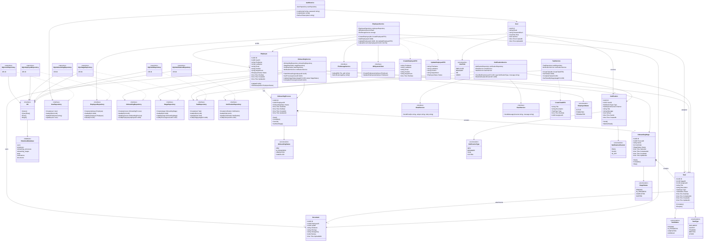

</> Markdown

```mermaid

classDiagram
    direction TB

    %% =====================================================
    %% DOMAIN
    %% =====================================================

    class User {
        +UUID ID
        +string Email
        +string PasswordHash
        +UserRole Role
        +bool IsActive
        +time.Time CreatedAt
        +time.Time UpdatedAt
    }

    class Employee {
        +UUID ID
        +UUID UserID
        +string FirstName
        +string LastName
        +string Email
        +string Position
        +string Department
        +EmployeeStatus Status
        +time.Time HireDate
        +time.Time CreatedAt
        +time.Time UpdatedAt
        +UpdateProfile()
        +SetStatus(status EmployeeStatus)
    }

    class OnboardingProcess {
        +UUID ID
        +UUID EmployeeID
        +OnboardingStatus Status
        +time.Time StartDate
        +time.Time EndDate
        +time.Time CreatedAt
        +time.Time UpdatedAt
        +Start()
        +Complete()
        +Cancel()
        +GetNextStage()
    }

    class OnboardingStage {
        +UUID ID
        +UUID ProcessID
        +string Name
        +int SortOrder
        +StageStatus Status
        +time.Time StartedAt
        +time.Time CompletedAt
        +time.Time CreatedAt
        +time.Time UpdatedAt
        +Start()
        +Complete()
        +Skip()
    }

    class Task {
        +UUID ID
        +UUID StageID
        +UUID AssigneeID
        +string Title
        +string Description
        +TaskType Type
        +TaskStatus Status
        +time.Time DueDate
        +time.Time CompletedAt
        +time.Time CreatedAt
        +time.Time UpdatedAt
        +Complete()
        +Reopen()
    }

    class Notification {
        +UUID ID
        +UUID UserID
        +NotificationType Type
        +NotificationChannel Channel
        +string Title
        +string Message
        +bool IsRead
        +time.Time SentAt
        +time.Time CreatedAt
        +Send()
        +MarkAsRead()
    }

    class Document {
        +UUID ID
        +UUID EmployeeID
        +UUID TaskID
        +string FileName
        +string FileType
        +string StorageKey
        +int64 FileSize
        +time.Time UploadedAt
    }

    %% =====================================================
    %% DOMAIN RELATIONSHIPS
    %% =====================================================

    User "1" --> "0..1" Employee : profile
    Employee "1" --> "0..*" OnboardingProcess : has
    OnboardingProcess "1" *-- "1..*" OnboardingStage : contains
    OnboardingStage "1" *-- "0..*" Task : contains
    User "1" --> "0..*" Task : assigned
    User "1" --> "0..*" Notification : receives
    Employee "1" --> "0..*" Document : owns
    Task "1" --> "0..*" Document : attachments

    %% =====================================================
    %% APPLICATION SERVICES
    %% =====================================================

    class AuthService {
        -UserRepository userRepository
        +Login(email string, password string)
        +Logout(token string)
        +RefreshToken(token string)
    }

    class EmployeeService {
        -EmployeeRepository employeeRepository
        -HRSystemClient hrClient
        -FileStorageService storage
        +CreateEmployee(dto CreateEmployeeDTO)
        +GetEmployee(id UUID)
        +UpdateEmployee(id UUID, dto UpdateEmployeeDTO)
        +UploadDocument(employeeID UUID, file File)
    }

    class OnboardingService {
        -OnboardingRepository onboardingRepository
        -StageRepository stageRepository
        -TaskRepository taskRepository
        -NotificationService notificationService
        +StartOnboarding(employeeID UUID)
        +GetProcess(processID UUID)
        +UpdateStageStatus(stageID UUID, status StageStatus)
        +CompleteProcess(processID UUID)
    }

    class TaskService {
        -TaskRepository taskRepository
        -NotificationService notificationService
        +CreateTask(dto CreateTaskDTO)
        +GetTask(id UUID)
        +CompleteTask(id UUID)
        +GetTasksByStage(stageID UUID)
    }

    class NotificationService {
        -NotificationRepository notificationRepository
        -EmailService emailService
        -SlackService slackService
        +SendNotification(userID UUID, type NotificationType, message string)
        +MarkAsRead(notificationID UUID)
    }

    %% =====================================================
    %% SERVICES -> DOMAIN
    %% =====================================================

    AuthService --> User
    EmployeeService --> Employee
    EmployeeService --> Document
    OnboardingService --> OnboardingProcess
    OnboardingService --> OnboardingStage
    OnboardingService --> Task
    TaskService --> Task
    NotificationService --> Notification

    %% =====================================================
    %% REPOSITORY INTERFACES
    %% =====================================================

    class UserRepository {
        <<interface>>
        +Create(user User)
        +GetByID(id UUID)
        +GetByEmail(email string)
        +Update(user User)
    }

    class EmployeeRepository {
        <<interface>>
        +Create(employee Employee)
        +GetByID(id UUID)
        +Update(employee Employee)
        +Delete(id UUID)
    }

    class OnboardingRepository {
        <<interface>>
        +Create(process OnboardingProcess)
        +GetByID(id UUID)
        +Update(process OnboardingProcess)
        +ListByEmployee(employeeID UUID)
    }

    class StageRepository {
        <<interface>>
        +Create(stage OnboardingStage)
        +GetByID(id UUID)
        +Update(stage OnboardingStage)
        +ListByProcess(processID UUID)
    }

    class TaskRepository {
        <<interface>>
        +Create(task Task)
        +GetByID(id UUID)
        +Update(task Task)
        +ListByStage(stageID UUID)
    }

    class NotificationRepository {
        <<interface>>
        +Create(notification Notification)
        +GetByID(id UUID)
        +Update(notification Notification)
        +ListByUser(userID UUID)
    }

    %% =====================================================
    %% SERVICES -> REPOSITORIES
    %% =====================================================

    AuthService --> UserRepository
    EmployeeService --> EmployeeRepository
    OnboardingService --> OnboardingRepository
    OnboardingService --> StageRepository
    OnboardingService --> TaskRepository
    TaskService --> TaskRepository
    NotificationService --> NotificationRepository

    %% =====================================================
    %% DATABASE REPOSITORY IMPLEMENTATIONS
    %% =====================================================

    class SQLUserRepository {
        <<repository>>
        -DB db
    }

    class SQLEmployeeRepository {
        <<repository>>
        -DB db
    }

    class SQLOnboardingRepository {
        <<repository>>
        -DB db
    }

    class SQLStageRepository {
        <<repository>>
        -DB db
    }

    class SQLTaskRepository {
        <<repository>>
        -DB db
    }

    class SQLNotificationRepository {
        <<repository>>
        -DB db
    }

    SQLUserRepository ..|> UserRepository
    SQLEmployeeRepository ..|> EmployeeRepository
    SQLOnboardingRepository ..|> OnboardingRepository
    SQLStageRepository ..|> StageRepository
    SQLTaskRepository ..|> TaskRepository
    SQLNotificationRepository ..|> NotificationRepository

    %% =====================================================
    %% DATABASE ABSTRACTION
    %% =====================================================

    class DB {
        <<interface>>
        +Query()
        +QueryRow()
        +Exec()
        +Begin()
    }

    SQLUserRepository --> DB
    SQLEmployeeRepository --> DB
    SQLOnboardingRepository --> DB
    SQLStageRepository --> DB
    SQLTaskRepository --> DB
    SQLNotificationRepository --> DB

    %% =====================================================
    %% EXTERNAL INTEGRATIONS
    %% =====================================================

    class EmailService {
        <<interface>>
        +SendEmail(to string, subject string, body string)
    }

    class SlackService {
        <<interface>>
        +SendMessage(channel string, message string)
    }

    class FileStorageService {
        <<interface>>
        +Upload(file File, path string)
        +GetURL(storageKey string)
    }

    class HRSystemClient {
        <<interface>>
        +CreateEmployee(employee Employee)
        +UpdateEmployee(employee Employee)
    }

    NotificationService --> EmailService
    NotificationService --> SlackService
    EmployeeService --> HRSystemClient
    EmployeeService --> FileStorageService

    %% =====================================================
    %% DATABASE
    %% =====================================================

    class RelationalDatabase {
        <<database>>
        users
        employees
        onboarding_processes
        onboarding_stages
        tasks
        notifications
        documents
    }

    DB --> RelationalDatabase

    %% =====================================================
    %% DTO
    %% =====================================================

    class CreateEmployeeDTO {
        +string FirstName
        +string LastName
        +string Email
        +string Position
        +string Department
        +time.Time HireDate
    }

    class UpdateEmployeeDTO {
        +string FirstName
        +string LastName
        +string Position
        +string Department
        +EmployeeStatus Status
    }

    class CreateTaskDTO {
        +string Title
        +string Description
        +TaskType Type
        +time.Time DueDate
        +UUID AssigneeID
    }

    EmployeeService ..> CreateEmployeeDTO
    EmployeeService ..> UpdateEmployeeDTO
    TaskService ..> CreateTaskDTO

    %% =====================================================
    %% ENUMS
    %% =====================================================

    class UserRole {
        <<enumeration>>
        EMPLOYEE
        MANAGER
        HR
        ADMIN
    }

    class EmployeeStatus {
        <<enumeration>>
        ACTIVE
        PROBATION
        TERMINATED
    }

    class OnboardingStatus {
        <<enumeration>>
        NEW
        IN_PROGRESS
        COMPLETED
        CANCELLED
    }

    class StageStatus {
        <<enumeration>>
        PENDING
        IN_PROGRESS
        COMPLETED
        SKIPPED
    }

    class TaskStatus {
        <<enumeration>>
        PENDING
        IN_PROGRESS
        COMPLETED
        OVERDUE
    }

    class TaskType {
        <<enumeration>>
        DOCUMENT
        ACCESS
        TRAINING
        MEETING
        OTHER
    }

    class NotificationType {
        <<enumeration>>
        INFO
        REMINDER
        TASK
        SYSTEM
    }

    class NotificationChannel {
        <<enumeration>>
        EMAIL
        SLACK
        IN_APP
    }

    User --> UserRole
    Employee --> EmployeeStatus
    OnboardingProcess --> OnboardingStatus
    OnboardingStage --> StageStatus
    Task --> TaskStatus
    Task --> TaskType
    Notification --> NotificationType
    Notification --> NotificationChannel

```